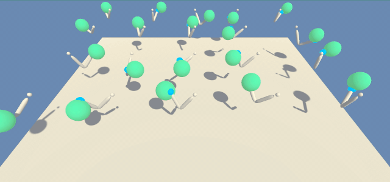
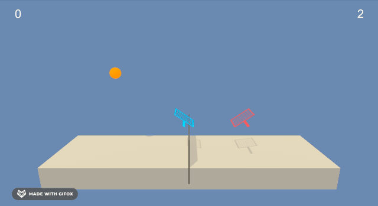

### 👋 Hello there, welcome to my GitHub page

My name is Tyron and I'm the creator of [Zetanote](https://zetanote.com). I enjoy the following activities:

- Training and deploying ML models in the cloud.
- Getting React to do exactly what I want.
- Wrangling Docker and Kubernetes.

About me:

- 🎓 University of Waterloo alum.
- 👔 Check out my [LinkedIn](https://www.linkedin.com/in/tyronjung/).
- ✍️ Check out my [writing](https://medium.com/@tyronjung).

### 🤖 Some reinforcement learning agents that I trained:

| [Continuous Control](https://tyranitar.notion.site/Continuous-Control-A2C-vs-D4PG-e3ff6b37be6349ee974a3fadd95d3e3b) | [Tennis](https://tyranitar.notion.site/Collaboration-and-Competition-D4PG-4a68f74a4ed3455b8244bee6187c085e) |
| :-: | :-: |
|  |  |
| AI learning to control its robot arm. | AI learning to play tennis against itself. |

### ✨ Some animations that I created for educational purposes:

| Continuous Space | Discrete Space |
| :-: | :-: |
|  |  |
| A neural network learning to separate data. | An [RBM](https://en.wikipedia.org/wiki/Restricted_Boltzmann_machine) daydreaming about handwritten digits. |
|  |  |
| The output landscape of a neural network as it learns. | Simulation of an ant colony gathering food. |

### 🧮 App that I created with my friend [Jonathan](https://github.com/jonmarkprice) to help students learn algebra:

