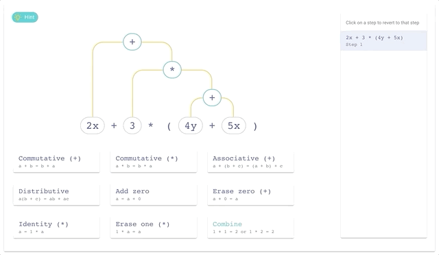
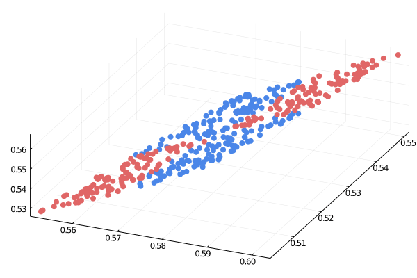

### 👋 Hi, I enjoy making learning apps and cool animations.

- 🎓 University of Waterloo alum.
- 👔 Check out my [LinkedIn](https://www.linkedin.com/in/tyronjung/).
- ✍️ Check out my [writing](https://medium.com/@tyronjung).

Check out this app that I made with my friend [Jonathan](https://github.com/jonmarkprice) - it helps students learn algebra:

Here are some animations that I created for educational purposes:

| Continuous Space | Discrete Space |
| :-: | :-: |
|  |  |
| A neural network learning to separate data. | An [RBM](https://en.wikipedia.org/wiki/Restricted_Boltzmann_machine) daydreaming about handwritten digits. |
|  |  |
| The output landscape of a neural network as it learns. | Simulation of an ant colony gathering food. |
